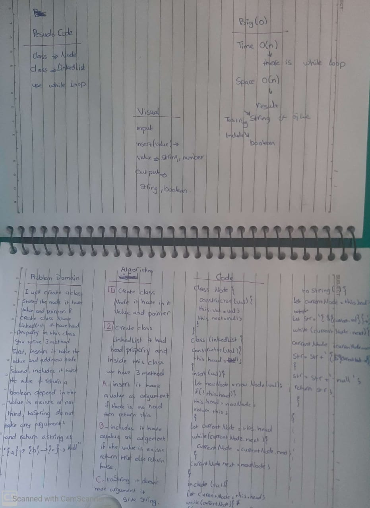

## Linked List
create linked list with node and method of insert incluse and to stringg
## Challenge
the challenge was in how to use linked list to first time.

## Approach & Efficiency
create a class name node and class name linked list inside this class you must add 3 method after you finish test the module.

## Solution
